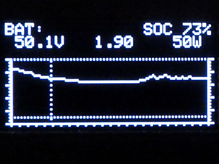

# Arduino library for SSD1322 (parallel mode) over I2C

## Some infos

OLED displays are getting cheaper. They need less power, are brighter and have a greater temperature range then LCDs.
At <http://mouser.com> I found an 128x64 monochrome display from Newhaven with 2.7' to possibly replace the GTK-281.

The display can be used in parallel mode or over SPI. As I needed I2C I modified the [parallel to I2C board from the GTK281](https://www.weigu.lu/microcontroller/ardlib_NT7534_I2C/index.html) PCB to use it for the new display.

The display is working like a charm, but it is quite slow.

## All infos on: <https://www.weigu.lu/microcontroller/ardlib_SSD1322_I2C/index.html>
